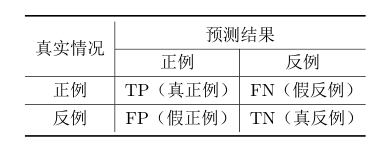
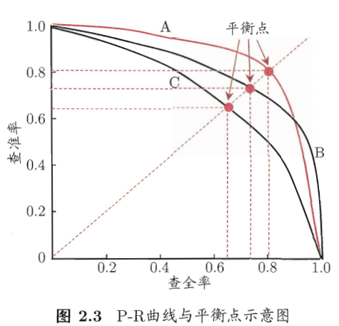

# 模型评估与选择

## 一、一种训练集一种算法

### 2.1经验误差与过拟合

m为样本数量（如m=10000张照片）,
Y为样本正确的结果，
Y'为预测结果，
其中有a个错了，
则error rate错误率是E=a/m,
accuracy精度为1-E,
error误差为|Y-Y'|

**过拟合与欠拟合**
过拟合(拟合过头):由两片都有锯齿的叶子，认为没有锯齿的叶子不是树叶，这就是拟合过头了
欠拟合(特征不够)：由两片绿叶，认为绿色的都是树叶，这就是欠拟合

**解决以上问题一般就是选泛化误差小的模型**

---

### 2.2评估方法【训练集与测试集】

#### 1. 泛化能力
即模型对没有见过数据的预测能力，训练集vs预测集

#### 2. trainning set训练集

用于估计模型

#### 3. testing set测试集的保留方法

用于检验魔心复杂程度

**留出法**：
e.g 
1.10年中，训练7年数据，预测后3年数据
2.10年中抽出7成的东西做训练集，3成做预测集

**交叉验证**：
k折交叉验证：一份数据分成k份，每次一个训练集对应一个测试集做出一个结果，最后结果取均值做为最终结果

**自助法**：
**原理：** 在包含m个样本的数据集D中，抽取m次样本(放回抽取)形成数据集D',那么一个数据一直没抽取到的概率为 $(1-\frac{1}{m})^m$,取极限m趋近于无穷时:

36.8%的数据未出现在D'中，于是可以用D'做训练集，D\D'做测试集
**适用：** 适用于数据集较小，难以划分的时候
**缺点：** 改变初始数据集分布，容易引起偏差

#### 4. validation set验证集
* 调参很难，很多参数都是人为规定的
* 比如三个参数，没个参数有5个候选值，对于一个训练集/测试集就有$5^3=125$个模型需要考察
* 为了调参，经常会加一个数据集、验证集
* 训练集训练，验证集看结果，调参，再看验证结果，参数调完，最后再在测试集上看结果

---

### 2.3性能度量performance management
#### 原理：
给定例集D={(x1,y1),(x2,y2),...,($x_m,y_m$)},其中$y_i$是$x_i$的真实标记。
要评估学习器*f*的性能，就要把预测结果f(x)和y做比较。

#### 均方误差mean squared error(最常用的性能度量)

#### 

若对于每个样例有不同的概率密度p(x),则：

#### 错误率与精度
error rate错误率：

其中II是指成立返回1，不成立返回0

accuracy精度:

#### 查准率、查全率与F1度量

##### Ⅰ.二分类问题

$$ confusion matirx混淆矩阵\left\{
\begin{aligned}
\text{true positive真正例(TP)} \\
\text{false positive假正例(FP)} \\
\text{true negative真反例(TN)} \\
\text{false negative假反例(FN)}
\end{aligned}
\right.$$

**查准率(Precision)**：
$P  =  \frac {TP}{TP+FP}$
**查全率(Recall)**：
$R  =  \frac {TP}{TP+FN}$

一般来说，查准率高时查全率低，查全率高时查准率低

P-R反向变动关系原理

P-R曲线（查准率查全率曲线）

A完全包住了C，因此A优于C
A和B有交点，不好判断AB的高低，因此有一些综合考虑查准率查全率的性能度量。

**最优阈值的确定**

1. 平衡点(Break-Event Point,简称BEP)
    P=R时的取值，如图A优于B

2. F1度量
    
    $\frac{1}{F1}=\frac{1}{2} * (\frac{1}{P}+\frac{1}{R})$
    
    得：
    $F1=\frac{2 * P * R}{P+R}=\frac{2 * TP}{样例总数+TP-TN}$

  

F1度量的一般形式： $F_β$

$\frac{1}{F_β}=\frac{1}{1+β^2}*(\frac{1}{P}+\frac{β^2}{R})$

得：
$F_β=\frac{(1+β^2)*P*R}{(β^2*P)+R}$

其中β>0度量了查全率对查准率的相对重要性,
$$ β\left\{
\begin{aligned}
\text{<1---查准率有更大影响} \\
\text{=1---------------退化为F1} \\
\text{>1---查全率有更大影响}
\end{aligned}
\right.$$

##### Ⅱ.n个二分类实现的多分类问题
$$ 多分类问题解决方法\left\{
\begin{aligned}
\text{直接使用算法} \\
\text{分解为n个二分类问题:OvsO、OvsR}
\end{aligned}
\right.$$

1. 先分别计算，再求平均值:
   假设多个二分类得到多组查准率与查全率的组合：$(P_1,R_1),(P_2,R_2),..,,(P_n,R_n)$.
   得到:
   宏查准率macro-P=$\frac{1}{n}*\sum^{n}_{i=1}P_i$,
   宏查全率macro-R=$\frac{1}{n}*\sum^{n}_{i=1}R_i$,
   带入F1公式得宏F1：
   macro-$F_1$=$\frac{2*\text{macro-P}*\text{macro-R}}{\text{macro-P}+\text{macro-R}}$

2. 先平均再计算
   先将几个要素求品均值$\bar{TP},\bar{FP},\bar{TN},\bar{FN}$,
   得到:
   微查准率micro-P=$\frac{\bar{TP}}{\bar{TP}+\bar{FP}}$,
   微查全率micro-R=$\frac{\bar{TP}}{\bar{TP}+\bar{FN}}$,
   带入F1公式得微F1:
   micro-$F_1$=$\frac{2*\text{micro-P}*\text{micro-R}}{\text{micro-P}+\text{micro-R}}$