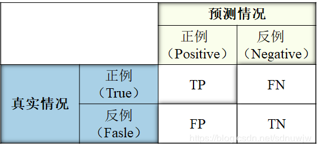
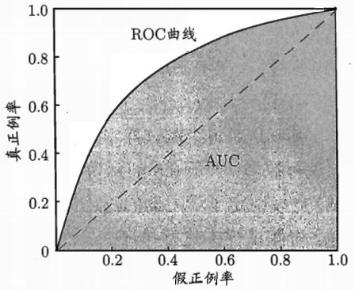
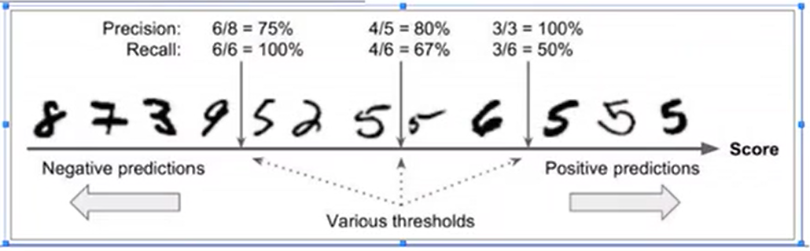
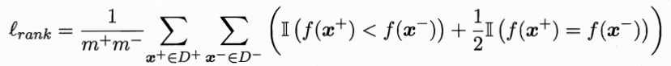
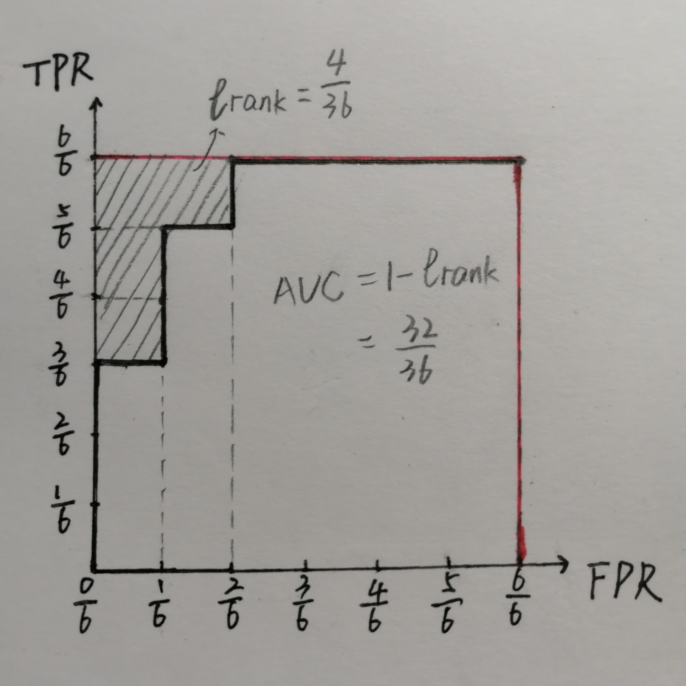

# 模型评估与选择

## 二、一种训练集多种算法

### ROC与AUC

### 

TPR(True Posituve Rate)=$\frac{TP}{TP+FN}$
FPR(False Posituve Rate)=$\frac{FP}{TP+FP}$

#### ROC示意图:

对于两条ROC曲线，TPR相同时FPR越小越好

#### AUC

AUC就是ROC曲线包裹的面积
**手写数字5识别例子解释rank-loss的计算：**
如图，5一共有$m^+$=6个，非5一共有$m^-$=6个：

$m_{-1}\text{ } m_{-2}\text{ } m_{-3} m_{-4} m_{1} m_{-5} m_{2} m_{3}\text{ } m_{-6}\text{ } m_{4}\text{ } m_{5}\text{ } m_{6}$

其中用$m_{i<0}$表示不是5的数的编号，用$m_{i>0}$表示是5的数的编号
那么rank-loss就是所有数字5右侧非5数字的个数和，再除以$m^+ * m^-$,即

此例中，$m_1$右侧有2个非5数字2($m_{-5}$)和4($m_{-6}$),$m_2$右侧有1个非5数字4($m_{-6}$),$m_3$右侧有1个非5数字4($m_{-6}$),$m_4$、$m_5$和$m_6$右侧没有非5数字。因此，rank-loss=$\frac{2+1+1}{6*6}=\frac{4}{36}=\frac{1}{9}$

$AOC=1-\text{rank-loss}$

**还是刚刚的例子解释AOC的计算：**

12&ensp;&ensp;11&ensp;&ensp;10&ensp;&ensp;9&ensp;&ensp;&ensp;8&ensp;&ensp;7&ensp;&ensp;&ensp;6&ensp;&ensp;&ensp;5&ensp;&ensp;&ensp;4&ensp;&ensp;&ensp;&ensp;3&ensp;&ensp;&ensp;2&ensp;&ensp;&ensp;1&ensp;&ensp;&ensp;0&ensp;=&ensp;$\theta$
($\theta$表示以它为临界值，大于这个位置的才认为是5)
$\frac{6}{6}$&ensp;&ensp;&ensp;$\frac{6}{6}$&ensp;&ensp;&ensp;$\frac{6}{6}$&ensp;&ensp;$\frac{6}{6}$&ensp;&ensp;$\frac{6}{6}$&ensp;&ensp;$\frac{5}{6}$&ensp;&ensp;&ensp;$\frac{5}{6}$&ensp;&ensp;$\frac{4}{6}$&ensp;&ensp;&ensp;$\frac{3}{6}$&ensp;&ensp;&ensp;$\frac{3}{6}$&ensp;&ensp;&ensp;$\frac{2}{6}$&ensp;&ensp;&ensp;$\frac{1}{6}$&ensp;&ensp;&ensp;$\frac{0}{6}$=TPR

$\frac{6}{6}$&ensp;&ensp;&ensp;$\frac{5}{6}$&ensp;&ensp;&ensp;$\frac{4}{6}$&ensp;&ensp;$\frac{3}{6}$&ensp;&ensp;$\frac{2}{6}$&ensp;&ensp;$\frac{2}{6}$&ensp;&ensp;&ensp;$\frac{1}{6}$&ensp;&ensp;$\frac{1}{6}$&ensp;&ensp;&ensp;$\frac{1}{6}$&ensp;&ensp;&ensp;$\frac{0}{6}$&ensp;&ensp;&ensp;$\frac{0}{6}$&ensp;&ensp;&ensp;$\frac{0}{6}$&ensp;&ensp;&ensp;$\frac{0}{6}$=FPR

得到ROC曲线：
