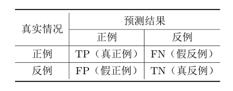

# 模型评估与选择

## 三、多种训练集多种算法

### 代价敏感错误率与代价曲线

由于不同类型的错误会造成不同的后果，所以可以为错误赋予“非均等代价”。

**二分类代价矩阵：**

其中，$cost_{ij}$表示将第i类样本预测为第j类样本的代价，一般$cost_{ii}$=0,若第0类预测为第1类损失更大，则$cost_{01}>cost_{10}$。损失程度相差越大，则差值越大。

若0为正类，1为反类，$D^+、D^-$代表样例集D的正例、反例集，则 **“代价敏感”(cost-sensitive)错误率** 为：

用“代价曲线”来反映学习器的总体代价：

横轴为取值为[0,1]的正例概率代价：
cost.png)
纵轴为取值为[0,1]的归一化代价：

**横轴的实际变量为p，使用P(+)cost的目的是让图像变为直线
两式的分母用于归一化，使得图像的横纵范围都在0~1**

(其中 $p=\frac{m^+}{m}$,$m^+为正例个数，m为总样例个数$,FNR=$\frac{FN}{TP+FN}$，FPR=$\frac{FP}{FP+TN}$)

例子：
https://www.bilibili.com/video/av79015715?p=23,
https://www.bilibili.com/video/av79015715?p=24,
https://www.bilibili.com/video/av79015715?p=25

