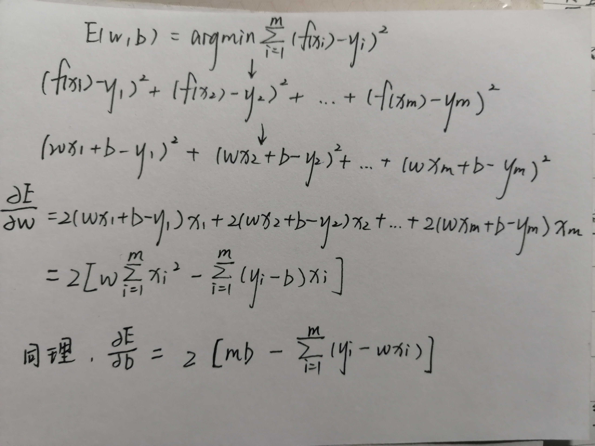
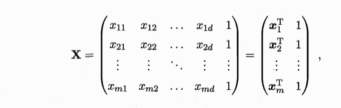
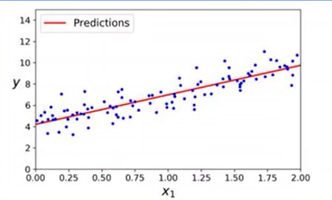

# 3.2线性回归

## 一元线性回归

### 问题描述

### 

### 目标函数
$min[(y_1-\hat{y_1})^2+(y_2-\hat{y_2})^2+...+(y_d-\hat{y_d})^2]$
由于$\hat{y}=w^Tx$,x已知，y已知，所以变量为w和b

### 矩阵说明
$x*w^T+B$->$\hat{y}$
(其中x是$m*d$的矩阵，w是$d*1$的矩阵，T次方 代表转秩,B是$d*1$的矩阵,
因此$\hat{y}$是$d*1$的矩阵)

### 求导

导数为0得w和b的最优解:
$w=\frac{\sum^m_{i=1}y_i(x_i-\bar{x})}{\sum^m_{i=1}x_i^2-\frac{1}{m}(\sum^m_{i=1}x_i)^2}$

$b=\frac{1}{m}\sum^m_{i=1}(y_i-wx_i)$

其中$\bar{x}=\frac{1}{m}\sum^m_{i=1}x_i$为x的均值

## 多元线性回归

### 关系式
$f(x_i)=w^Tx_i+b$,使得f(x_i)≈$y_i$

### 目标函数

### 

把标记也写成向量形式：$y=(y_1;y_2;...;y_m)$
有：

**多元在于w变成了多元的**

### 目标函数求解
当$X^TX$为满秩矩阵或正定矩阵时，

令上式为0，则最终学得的多元线性回归方程为：

### 实例图像（最佳拟合直线）

### 

## 对数线性回归(log-linear regression)

### 原型
$y=w^Tx+b$

### 对数
$lny=w^Tx+b$

### 本质

### 

## 广义线性模型(genegralize linear model)
考虑更一般的情况，有link function联系函数为g()

g(y)=$w^Tx+b$
则：
y=$g^{-1}(w^Tx+b)$